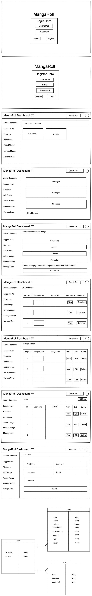

# Manga_Roll
Mangaroll is an application that allows users to upload their favorite manga onto their profile.

## Technologies Used
- Python
- Django
- HTML
- CSS
- Bootstrap
- Cloudinary

## Collaborators
Full Stack Developers:
- Raymond Lee
- Tsung Yen Wu

## User Stories
- User can store their favorite manga and share their list with others.
- User can export their favorite manga list in various file types.
- User can compile a list of their favorite manga.
- User can upload mangas' cover and smaller sized PDF's.

## Major Hurdles (Solved)
- Be able to upload and edit profile image on the front-end using Cloudinary.
- Be able to add managa cover images and upload PDF files using Cloudinary.
- Having all the routes rendered and redirected correctly.  

## Work in progress
- Allow users to view all user profiles without needing them to share an exported file.
- Allow users to have a chat room.
- Allow users to download larger sized PDF's.
- Allow users to share their comments in the comment section of the shared manga.

## Initial Wiredframe and ERD

